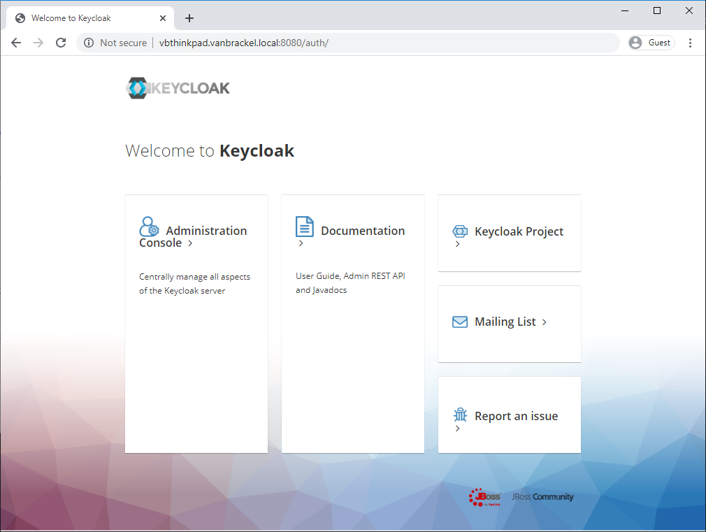
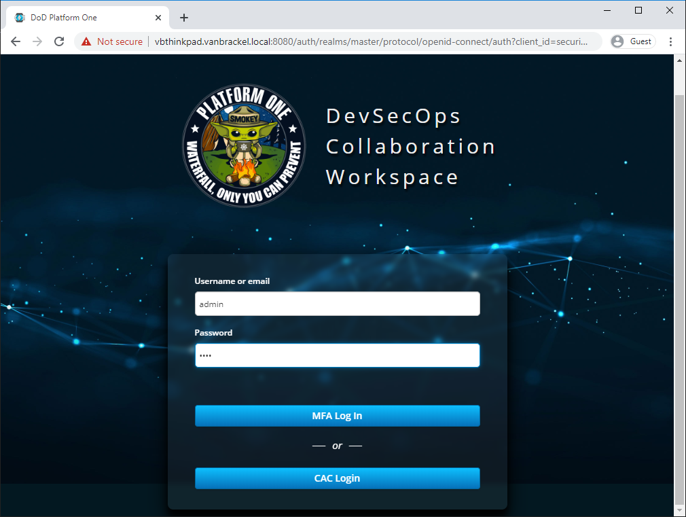
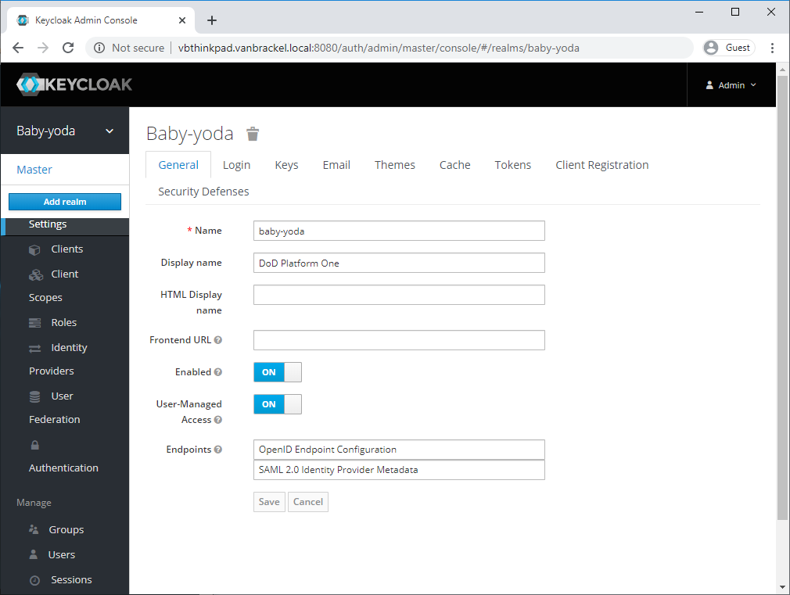
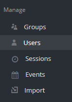
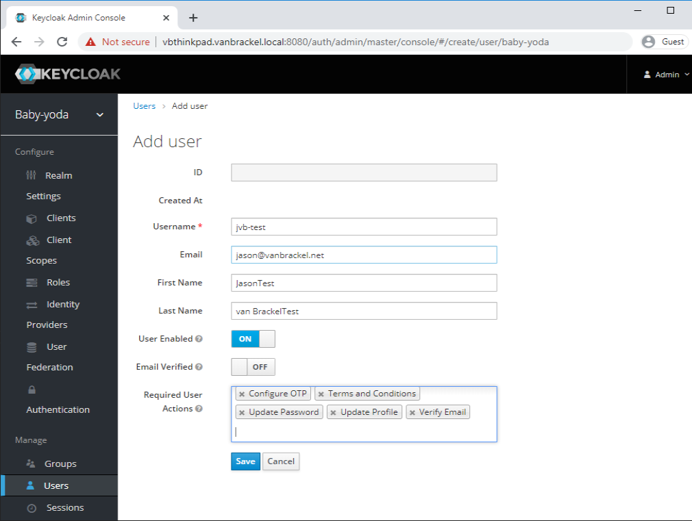
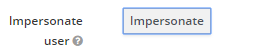
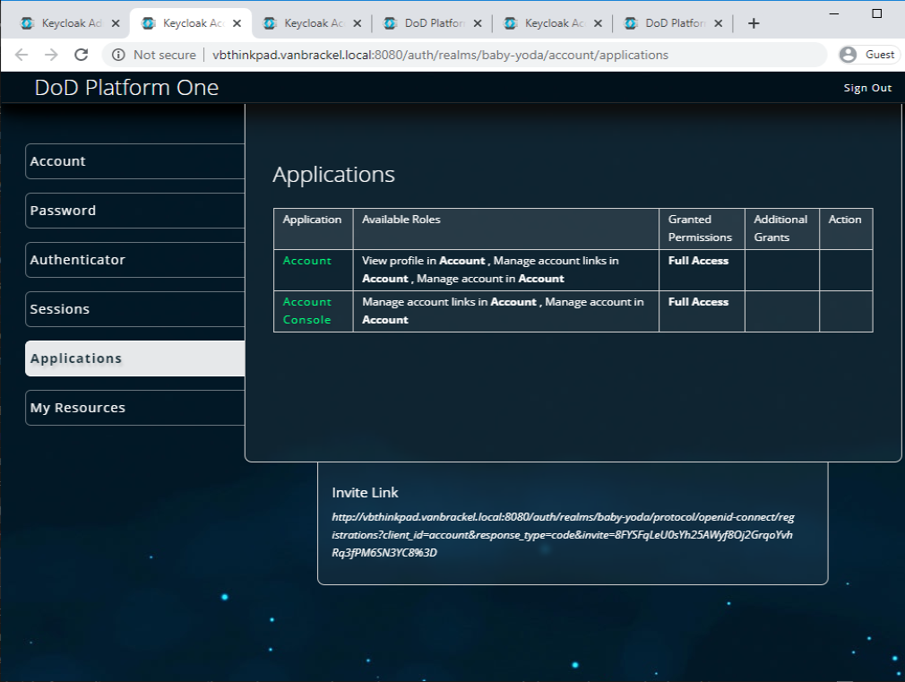
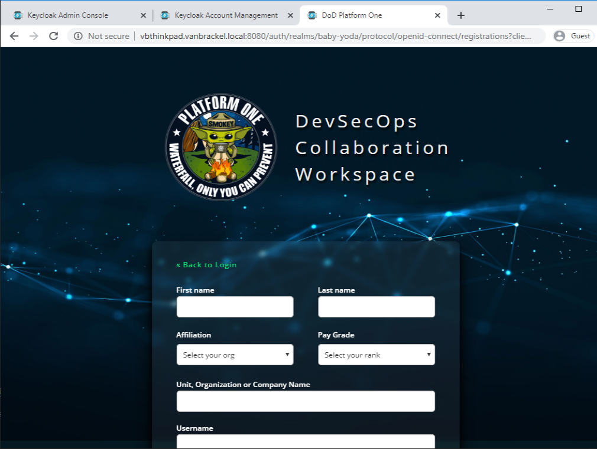

# Manually Creating a Test Case

1. Navigate to keycloack, Select Adminstration Console

2. Login as an administrator username: admin password: pass

3. Make sure you're in the baby-yoda realm

4. Under Manage, select Users

5. Add a test user, Select User Required Actions that include
  - Configure OTP
  - Terms and Conditions
  - Update Password
  - Update Profile
  - Verify Email
  Then, click Save

6. Now impersonate the user

7. The invite link will be at the bottom of the page

8. Copy the invite link, and paste it into the browser, navigate to the invite page.  The registration page should be displayed.

